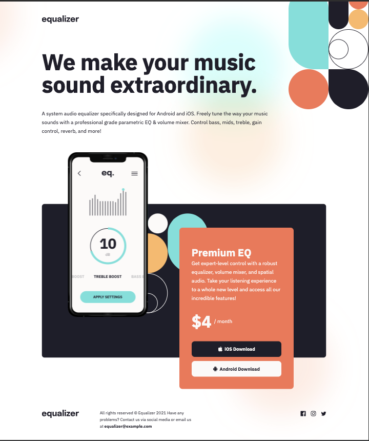
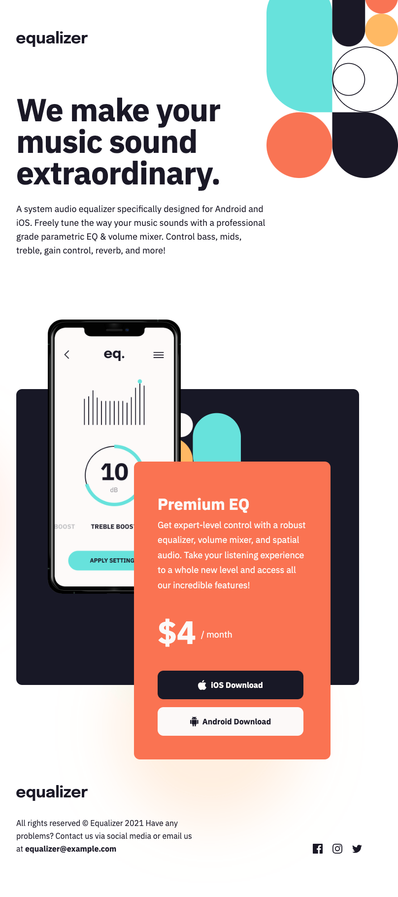
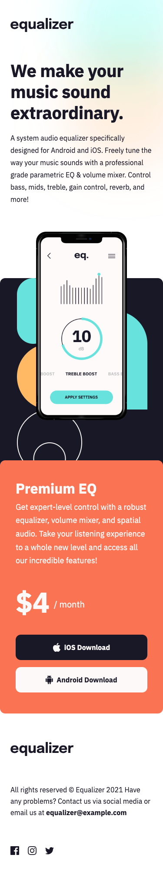
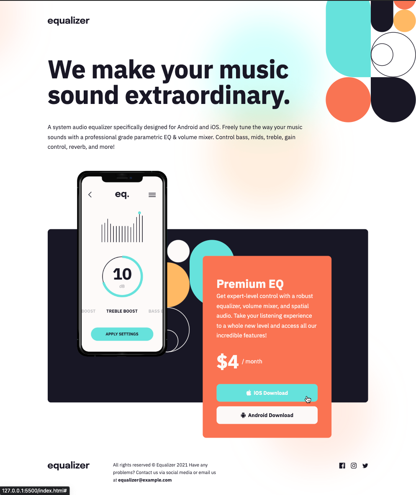

# Frontend Mentor - Equalizer landing page solution

This is a solution to the [Equalizer landing page challenge on Frontend Mentor](https://www.frontendmentor.io/challenges/equalizer-landing-page-7VJ4gp3DE).

## The challenge

Your challenge is to build out this order summary card component and get it looking as close to the design as possible.

You can use any tools you like to help you complete the challenge. So if you've got something you'd like to practice, feel free to give it a go.

Your users should be able to:

- See hover states for interactive elements

## Where to find everything

Your task is to build out the project to the designs inside the `preview.jpg`.

You will find all the required assets in the `./assets` folder. The assets are already optimized.

### Screenshots

#### Desktop

  

#### Tablet

  

#### Mobile

  

#### Active states

  
  &nbsp
  

### Built with

- Semantic HTML5 markup
- CSS custom properties
- CSS grid
- CSS Flexbox
- Media queries
- Visual Studio Code
